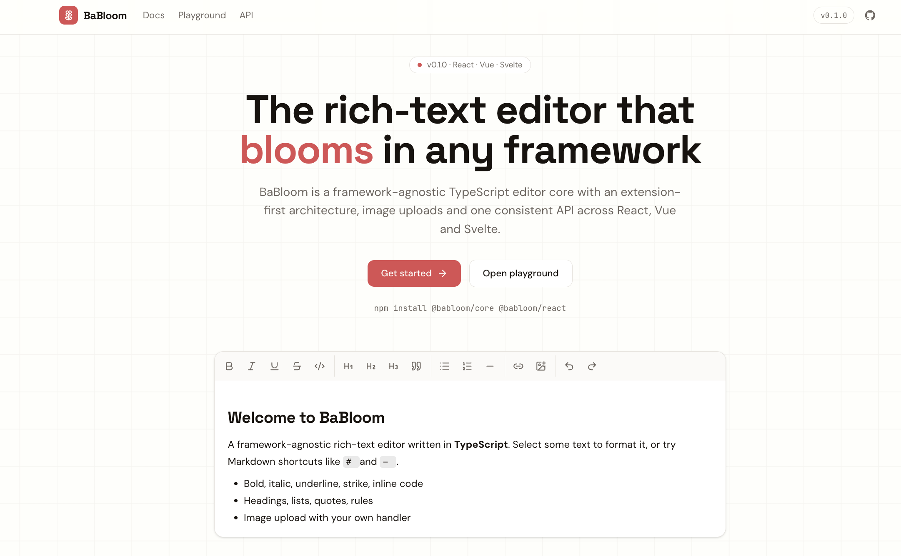

# 🌸 BaBloom Core



> Framework-agnostic, TypeScript-first rich-text editor core for BaBloom.

`@scope/babloom-core` is the framework-independent engine behind BaBloom.

It provides the core editor state, content management, formatting, serialization, events, and extension system without depending on React, Vue, Svelte, or any other UI framework.

Build your own editor experience on top of the BaBloom core.

## ✨ Features

- 📝 Rich-text editing
- **Bold**
- *Italic*
- ~~Strikethrough~~
- Underline
- Headings
- Paragraphs
- Ordered lists
- Unordered lists
- Blockquotes
- Code blocks
- Inline code
- Links
- Text alignment
- Undo / redo
- Keyboard shortcuts
- Selection handling
- 🖼️ Image support
- Image insertion
- Image selection
- Editor events
- Content serialization
- Extensible editor architecture
- TypeScript-first API
- Framework independent

## 📦 Installation

### npm

```bash
npm install @scope/babloom-core
